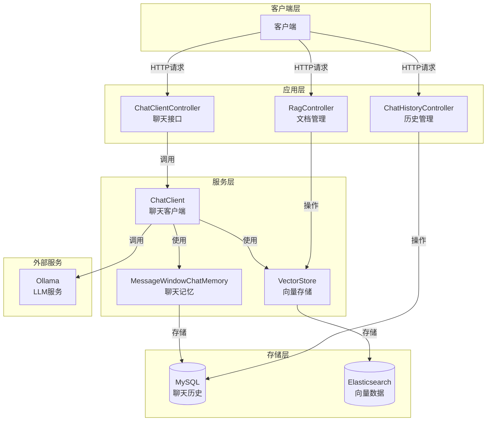
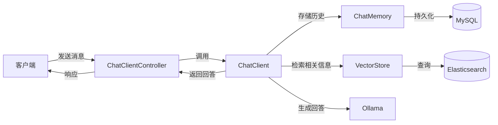
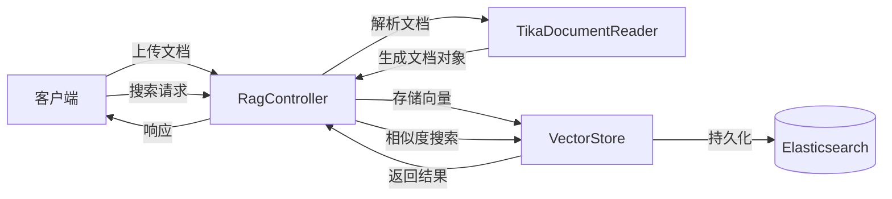

# spring-aix 项目架构分析报告

## 1. 系统整体架构设计

### 1.1 架构概述

spring-aix 是一个基于 Spring Boot 和 Spring AI 构建的智能聊天系统，集成了 RAG (Retrieval-Augmented Generation) 能力，提供了完整的 AI 聊天和知识管理功能。

### 1.2 架构图

## 2. 模块划分与职责

| 模块名称     | 主要职责         | 文件位置                          | 核心功能                      |
| ------------ | ---------------- | --------------------------------- | ----------------------------- |
| 应用启动模块 | 应用初始化与配置 | `SpringAIX.java`                  | 启动 Spring Boot 应用         |
| 配置模块     | 聊天客户端配置   | `config/ChatConfig.java`          | 配置 ChatMemory 和 ChatClient |
| 聊天接口模块 | 提供聊天功能     | `chat/ChatClientController.java`  | 处理聊天请求，支持流式响应    |
| 历史管理模块 | 管理聊天历史     | `chat/ChatHistoryController.java` | 查看、清除聊天历史            |
| RAG 模块     | 文档管理与检索   | `chat/RagController.java`         | 上传文档、相似度搜索          |

## 3. 核心业务流程

### 3.1 聊天流程

1. 客户端发送聊天请求到 `/api/v2/generate` 或 `/api/v2/generate-stream` 接口
2. ChatClientController 接收请求，生成或使用现有会话 ID
3. 调用 ChatClient 处理请求，ChatClient 会：
   - 通过 MessageChatMemoryAdvisor 管理聊天历史
   - 通过 QuestionAnswerAdvisor 从向量库检索相关信息
   - 调用 Ollama 模型生成回答
4. 返回生成的回答，流式接口返回 Flux 响应

### 3.2 RAG 流程

1. 客户端上传文档到 `/rag/upload` 接口
2. RagController 接收文件，使用 TikaDocumentReader 读取文档内容
3. 将文档转换为向量存储到 Elasticsearch
4. 客户端通过 `/rag/similaritySearch` 接口搜索相关文档
5. RagController 调用 VectorStore 进行相似度搜索并返回结果

### 3.3 聊天历史管理流程

1. 客户端通过 `/history/getAllConversationIds` 获取所有会话 ID
2. 通过 `/history/query/{conversationId}` 查询特定会话的聊天历史
3. 通过 `/history/clear/{conversationId}` 清除特定会话的聊天历史

## 4. 技术栈选型及合理性评估

| 技术          | 版本  | 用途          | 合理性评估                                     |
| ------------- | ----- | ------------- | ---------------------------------------------- |
| Spring Boot   | 3.5.8 | 基础框架      | 合理，提供了完整的 web 应用支持                |
| Spring AI     | 1.1.0 | AI 能力集成   | 合理，提供了与多种 AI 模型的集成能力           |
| Ollama        | -     | 本地 LLM 服务 | 合理，支持本地部署模型，降低依赖外部服务的风险 |
| Elasticsearch | -     | 向量存储      | 合理，提供了高效的向量检索能力，适合 RAG 场景  |
| MySQL         | -     | 聊天历史存储  | 合理，关系型数据库适合存储结构化的聊天历史数据 |
| Tika          | -     | 文档解析      | 合理，支持多种文档格式的解析                   |

## 5. 数据流转路径

### 5.1 聊天数据流程

### 5.2 文档处理流程

## 6. 接口设计规范

| 接口路径                          | 方法 | 功能描述        | 请求参数                       | 响应类型          |
| --------------------------------- | ---- | --------------- | ------------------------------ | ----------------- |
| `/api/v2/generate`                | GET  | 生成回答        | conversationId (可选), message | String            |
| `/api/v2/generate-stream`         | GET  | 流式生成回答    | conversationId (可选), message | TEXT_EVENT_STREAM |
| `/history/getAllConversationIds`  | GET  | 获取所有会话 ID | 无                             | List<String>      |
| `/history/query/{conversationId}` | GET  | 查询聊天历史    | conversationId                 | List<Message>     |
| `/history/clear/{conversationId}` | GET  | 清除聊天历史    | conversationId                 | void              |
| `/rag/upload`                     | POST | 上传文档        | file (MultipartFile)           | void              |
| `/rag/similaritySearch`           | POST | 相似度搜索      | query                          | List<Document>    |

## 7. 依赖关系管理

### 7.1 模块依赖

- spring-deepl (父模块)
  - spring-aix (子模块)

### 7.2 外部依赖

| 依赖                                                | 版本  | 用途                   |
| --------------------------------------------------- | ----- | ---------------------- |
| spring-boot-starter-web                             | 3.5.8 | Web 应用支持           |
| spring-boot-starter-actuator                        | 3.5.8 | 应用监控               |
| spring-boot-starter-data-jpa                        | 3.5.8 | JPA 支持               |
| mysql-connector-j                                   | -     | MySQL 驱动             |
| spring-ai-starter-model-ollama                      | 1.1.0 | Ollama 模型集成        |
| spring-ai-starter-model-chat-memory-repository-jdbc | 1.1.0 | 聊天记忆 JPA 存储      |
| spring-ai-advisors-vector-store                     | 1.1.0 | 向量存储顾问           |
| spring-ai-starter-vector-store-elasticsearch        | 1.1.0 | Elasticsearch 向量存储 |
| spring-ai-tika-document-reader                      | 1.1.0 | Tika 文档读取器        |

## 8. 扩展性与可维护性评估

### 8.1 扩展性评估

- **模块划分清晰**：各模块职责明确，便于扩展
- **依赖注入设计**：使用 Spring 依赖注入，便于替换实现
- **配置化管理**：通过 application.yaml 管理配置，便于环境切换
- **向量存储抽象**：使用 VectorStore 接口，可替换不同的向量存储实现

### 8.2 可维护性评估

- **代码结构清晰**：遵循 Spring Boot 最佳实践
- **使用 Lombok**：减少样板代码，提高可读性
- **日志记录**：使用 slf4j 进行日志记录
- **配置分离**：配置与代码分离，便于维护

## 9. 潜在技术风险点识别

1. **外部服务依赖**：依赖 Ollama 服务的可用性
2. **向量存储容量**：随着文档增加，Elasticsearch 存储需求会增长
3. **性能瓶颈**：聊天生成和向量检索可能成为性能瓶颈
4. **安全性**：缺乏对上传文档的安全检查
5. **错误处理**：缺乏完善的错误处理机制
6. **监控不足**：虽然集成了 Actuator，但缺乏针对 AI 服务的专门监控

## 10. 优化建议和改进方向

### 10.1 架构优化

1. **服务分层**：增加服务层，将业务逻辑从控制器中分离
2. **缓存机制**：添加缓存层，减少重复的向量检索
3. **异步处理**：对文档上传和处理采用异步方式，提高响应速度
4. **多模型支持**：增加对多种 LLM 模型的支持，提高灵活性

### 10.2 性能优化

1. **连接池优化**：根据实际负载调整数据库连接池大小
2. **向量存储优化**：优化 Elasticsearch 配置，提高检索性能
3. **批处理**：对文档处理采用批处理方式，减少网络开销
4. **响应式增强**：进一步利用响应式编程，提高系统吞吐量

### 10.3 安全性增强

1. **文档安全检查**：添加对上传文档的安全检查，防止恶意文件
2. **认证授权**：添加用户认证和授权机制，保护接口安全
3. **输入验证**：加强对用户输入的验证，防止注入攻击
4. **敏感信息保护**：对配置中的敏感信息进行加密处理

### 10.4 可维护性改进

1. **单元测试**：增加单元测试覆盖率，提高代码质量
2. **文档完善**：完善项目文档，包括 API 文档和架构文档
3. **日志增强**：增加关键操作的日志记录，便于问题排查
4. **监控扩展**：增加针对 AI 服务的专门监控指标

### 10.5 功能扩展

1. **多语言支持**：增加多语言聊天能力
2. **文档管理**：增加文档管理功能，支持文档分类和标签
3. **对话总结**：增加对话总结功能，便于用户快速了解对话内容
4. **个性化配置**：允许用户自定义聊天参数和模型配置

## 11. 总结

spring-aix 项目是一个基于 Spring Boot 和 Spring AI 构建的智能聊天系统，集成了 RAG 能力，提供了完整的 AI 聊天和知识管理功能。系统架构清晰，模块划分合理，技术选型适当，具有良好的扩展性和可维护性。

通过本次架构分析，我们识别了系统的核心组件和业务流程，评估了技术栈的合理性，分析了数据流转路径，并识别了潜在的技术风险点。基于这些分析，我们提出了一系列优化建议和改进方向，包括架构优化、性能优化、安全性增强、可维护性改进和功能扩展等方面。

这些建议和改进方向将有助于系统的持续演进和优化，提高系统的性能、安全性和可维护性，为用户提供更好的智能聊天和知识管理体验。